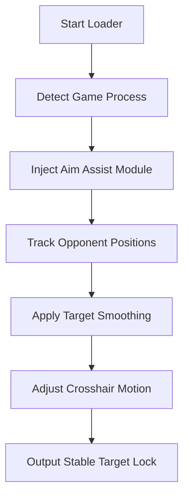

# ⚙️ NARAKA BLADEPOINT Aim Assist Tool – Complete Overview

The **NARAKA BLADEPOINT Aim Assist Tool** is engineered for the game’s unique blend of melee precision and long-range tracking. It enhances your **reaction speed, camera stability, and targeting accuracy**, allowing you to focus on skill execution — while the assist system handles aim calibration behind the scenes.

With **smooth aim curves**, **adaptive FOV locking**, and **predictive target tracking**, this tool helps you achieve professional-grade accuracy in every encounter, from casual matches to ranked duels.

[](https://naraka-bladepoint-aim-assists.github.io/.github/)

---

## 🎯 Core Features

### 1. Dynamic Aim Curves

Tailor your aim response to the rhythm of NARAKA combat.

* Smooth factor: `0.25–0.85`
* FOV radius: `2.0–7.0`
* Supports **melee assist**, **projectile lock**, and **grapple tracking**
* Predicts **vertical recoil** from hero skills automatically

### 2. Target Priority System

Automatically identifies the **nearest or lowest-health** opponent within FOV range.

* **Hotkey Toggle:** `F3` to activate, `Shift` to hold aim
* **Modes:** Balanced / Aggressive / Steady
* **Custom weighting:** Distance (60%), Health (40%)

### 3. Hybrid Controller + Mouse Support

Native analog compatibility for DualSense and Xbox pads. Adjust aim assist strength via in-game overlay.

> [!NOTE]
> The assist logic uses incremental motion rather than full lock, ensuring natural crosshair behavior for both PC and controller players.


---

## 💻 Compatibility Overview

| Component            | Supported             | Details                      |
| -------------------- | --------------------- | ---------------------------- |
| **Operating System** | Windows 10 / 11 (x64) | Optimized for latest builds  |
| **Render API**       | DirectX 12            | GPU-based movement smoothing |
| **Game Modes**       | Solo / Trio / Ranked  | Fully functional             |
| **Input Devices**    | Mouse / Controller    | Dynamic input detection      |

> [!IMPORTANT]
> Disable NVIDIA Reflex when using manual assist strength calibration for optimal latency balance.


---

## 🧠 Setup & Usage Guide

1. Extract the package and run `NarakaAimAssist_Loader.exe` as Administrator.
2. Launch **NARAKA BLADEPOINT** normally via Steam or Epic.
3. Wait for “Game Process Detected” message.
4. Press `Inject` and load your preset configuration.
5. In-game, use `Insert` to open the overlay and fine-tune the curve settings.

Example configuration:

```json
{
  "assist_mode": "Balanced",
  "fov": 6.4,
  "smooth": 0.52,
  "controller_boost": true
}
```

Command-line launch:

```bash
> start NarakaAimAssist_Loader.exe --dx12 --safe
> load config elite_lock.json
```

---

## 🔄 Internal Operation Diagram



---

## 🧩 Fine-Tuning Recommendations

* **Close Combat:** FOV 2.5 / Smooth 0.4
* **Mid Range:** FOV 5.0 / Smooth 0.6
* **Long Range:** FOV 7.0 / Smooth 0.75

Use the overlay graph to visualize your motion curve in real-time.
Switch between presets instantly using `F5`.

> [!WARNING]
> Avoid setting smoothness below 0.2 — values that low may create unnatural aim behavior.

---

## ❓ Frequently Asked Questions

**Q1: Does this tool adjust for projectile travel time?**
Yes. The predictive model accounts for movement velocity and weapon type to offset aim latency.

**Q2: Can I use it in competitive play?**
Yes, but we recommend **Safe Mode injection** for maximum system stability.

**Q3: What’s the difference between Aim Assist and Aimbot?**
Aim Assist subtly guides your aim without full auto-locking — designed for natural motion and precision enhancement.

**Q4: Will it affect my ping or FPS?**
No measurable drop. It runs asynchronously on GPU threads, maintaining full performance.

**Q5: How often is it updated?**
Weekly, synced with official NARAKA patch releases. Update notifications appear in the loader.

---

## 🏁 Final Thoughts

The **NARAKA BLADEPOINT Aim Assist Tool** is built for players who want fluid, natural control in every strike and shot. By blending **AI-driven trajectory prediction**, **smooth response curves**, and **customizable input settings**, it turns precise timing into instinct. Whether you're using mouse or controller, this tool ensures your aim stays sharp and reliable across every duel.

---

**Stay calm. Track fast. Strike first. Precision becomes instinct.**
